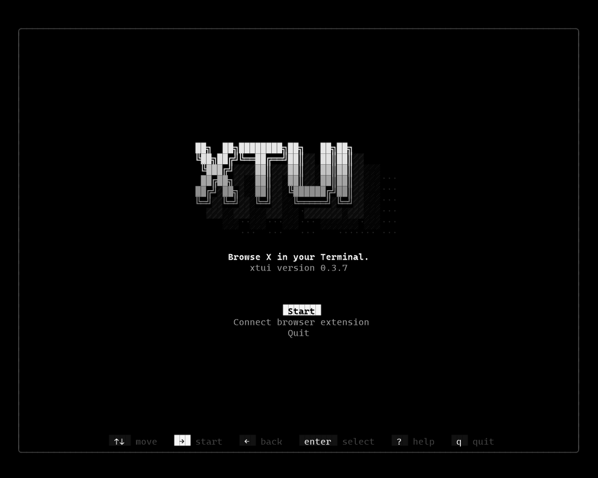
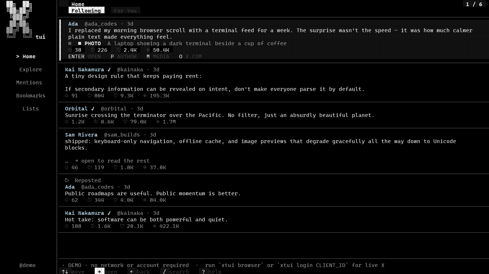

```
██╗  ██╗████████╗██╗   ██╗██╗
╚██╗██╔╝╚══██╔══╝██║   ██║██║
 ╚███╔╝    ██║   ██║   ██║██║
 ██╔██╗    ██║   ██║   ██║██║
██╔╝ ██╗   ██║   ╚██████╔╝██║
╚═╝  ╚═╝   ╚═╝    ╚═════╝ ╚═╝
```

# XTUI

**X, without leaving your terminal.**

A read-only, keyboard-first client for [X](https://x.com). Browse Following, For You, search, mentions, bookmarks, lists, profiles, and threads in a black-and-white TUI. Sign in once in Chrome or Edge — XTUI uses that session and never copies cookies.

[](https://github.com/Panther114/XTUI/releases/latest)
[](https://github.com/Panther114/XTUI/stargazers)
[](https://github.com/Panther114/XTUI/actions/workflows/ci.yml)
[](LICENSE)

<p align="center">
  
</p>

<p align="center">
  
</p>

## Install

**Fastest:** download a prebuilt from [Releases](https://github.com/Panther114/XTUI/releases/latest), then run it.

| Platform | File |
|---|---|
| Windows x64 | `xtui-windows-x86_64.exe` |
| Linux x64 | `xtui-linux-x86_64` |
| macOS Apple Silicon | `xtui-macos-aarch64` |

```bash
# Windows (PowerShell)
Invoke-WebRequest -Uri https://github.com/Panther114/XTUI/releases/latest/download/xtui-windows-x86_64.exe -OutFile xtui.exe
.\xtui.exe demo

# Linux
curl -L https://github.com/Panther114/XTUI/releases/latest/download/xtui-linux-x86_64 -o xtui
chmod +x xtui && ./xtui demo

# macOS (Apple Silicon)
curl -L https://github.com/Panther114/XTUI/releases/latest/download/xtui-macos-aarch64 -o xtui
chmod +x xtui && ./xtui demo
```

**Or from Node 18+** — the launcher downloads the matching binary on first run:

```bash
npx --yes github:Panther114/XTUI demo
```

**Or from source** (Rust 1.85+):

```bash
cargo install --git https://github.com/Panther114/XTUI --locked
xtui demo
```

## Read your own X timeline

1. Sign in to [x.com](https://x.com) in Edge or Chrome.
2. Install the native host and print the extension folder:

```bash
xtui extension install --edge    # or --chrome
xtui extension path
```

3. In `edge://extensions` or `chrome://extensions`, turn on **Developer mode**, click **Load unpacked**, and select that folder.
4. Start the live client:

```bash
xtui extension status --edge
xtui
```

`xtui demo` still works offline with no account.

## Keys

| Keys | Action |
|---|---|
| `j` / `k` or arrows | Move |
| `Enter` / `→` | Open |
| `Esc` / `←` | Back |
| `1`–`5` | Home, Explore, Mentions, Bookmarks, Lists |
| `f` | Following / For You |
| `/` | Search |
| `M` / `O` | Preview media / open on x.com |
| `?` | Help |
| `Q` | Quit |

## Compatibility

| | Supported |
|---|---|
| OS (prebuilt) | Windows x64, Linux x64, macOS Apple Silicon |
| OS (from source) | Any target Rust can build, including Intel Mac |
| Terminal | Any modern terminal; truecolor looks best |
| Browser bridge | Microsoft Edge and Google Chrome |
| Runtime | Node 18+ for `npx`; Rust 1.85+ to compile |
| X | Your existing browser session, or optional official API |

Not included: Firefox, Intel-Mac / ARM-Linux / ARM-Windows prebuilts, posting, likes, follows, or DMs. XTUI is read-only.

Config lives in `%APPDATA%\xtui\config.json` on Windows and `~/.config/xtui/config.json` on Linux and macOS. Set `XTUI_MOTION=off` to freeze decorative animation.
